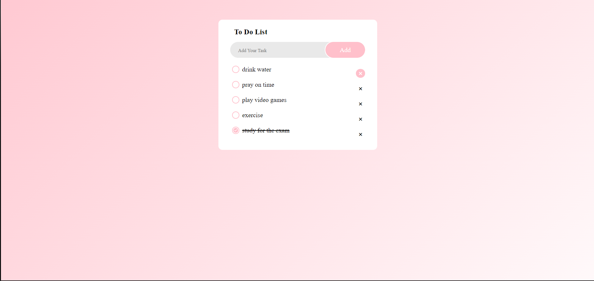

# 📝 To-Do List App

A clean and responsive To-Do List web app built using **HTML**, **CSS**, and **JavaScript**. This project helps users manage daily tasks by adding, checking off, and removing to-dos — with data saved in the browser's `localStorage`.

---

## 📸 Demo

 <!-- Add your screenshot image here -->

---

## 🚀 Features

- ✅ Add and remove tasks easily
- ✔️ Mark tasks as complete (with stylish checkmark)
- 💾 Persistent storage with `localStorage`
- 🎨 Responsive design and soft color theme
- 💻 Built from scratch with pure HTML, CSS & JS — no frameworks

---

## 🛠️ Tech Stack

- **HTML5** — Structure
- **CSS3** — Styling & responsiveness
- **JavaScript (Vanilla)** — Interactivity & storage

---

## 📁 Project Structure
To-Do-List/
│
├── index.html # Main HTML file
├── CSS/
│ ├── style.css # Custom styles
│ └── normalize.css # Normalize for consistent styling
├── JS/
│ └── main.js # Core logic & localStorage
└── README.md # Project overview


---

## ⚙️ How It Works

1. Type a task into the input field.
2. Click **"Add"** to insert it into your to-do list.
3. Check the checkbox to mark as completed — the label gets a line-through.
4. Click ❌ to delete the task.
5. All data is stored in `localStorage`, so tasks stay even if you reload.

---

## 📲 Responsive Design

The app is mobile-friendly and adjusts layout for smaller screens using CSS media queries.

---

## 📦 Getting Started

To run the app locally:

1. Clone the repository:

```bash
git clone https://github.com/Mary-Eqdaih/To-Do-List.git
cd To-Do-List

